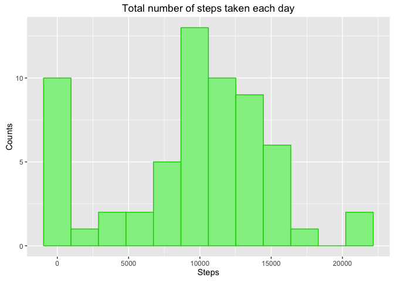

# Reproducible Research: Peer Assessment 1


---
title: "Markdown & Knitr Assignment"
author: "Daniel Mejia"
date: "20/10/2016"
output: html_document
---


This document describe the steps required to pre-process and clean the data in order to generate the required plots.

## Process 

### 1. Load Data
The first step is to load the data from the directory. The file provided for this assigment is in compressed format, for that reason we need to uncompress the 
file before load the data.


```r
library(reshape2)
library(ggplot2)
```

```
## Warning: package 'ggplot2' was built under R version 3.2.4
```

```r
# setwd("~/CursoDS/curso5/week2/RepData_PeerAssessment1")
data <- read.table(unz("activity.zip", "activity.csv"), header=T, quote="\"", sep=",")
```

### Preview the data
In this phase we need to look in the dad to figure out if the data is complete or if some values are missing. Also we need to discover the structure of the data, the data types and have some idea about the lenght of the data.


```r
str(data)
```

```
## 'data.frame':	17568 obs. of  3 variables:
##  $ steps   : int  NA NA NA NA NA NA NA NA NA NA ...
##  $ date    : Factor w/ 61 levels "2012-10-01","2012-10-02",..: 1 1 1 1 1 1 1 1 1 1 ...
##  $ interval: int  0 5 10 15 20 25 30 35 40 45 ...
```

As we can see, we have a data frame with three variables and 17568 observations. The first data shown  in the str function give and idea that many observations has NA values. Let's see how many NA values we have.

Calculate the NA by variable

```r
apply(apply(data, 2, is.na),2  , sum)
```

```
##    steps     date interval 
##     2304        0        0
```

Calculate the percent of NA by variable


```r
apply(apply(data, 2, is.na),2  , mean)
```

```
##     steps      date  interval 
## 0.1311475 0.0000000 0.0000000
```

The data has 13% of observation with NA values. This observation will be imputed in the following sections.

First we need to do some changes with the structure and data types to make easier the required calculations.


## Convert the date variable from Factor to Date

In this step the date variable is converted from Factor to Date datatype.


```r
data$date <- as.Date(as.character(data$date))
str(data)
```

```
## 'data.frame':	17568 obs. of  3 variables:
##  $ steps   : int  NA NA NA NA NA NA NA NA NA NA ...
##  $ date    : Date, format: "2012-10-01" "2012-10-01" ...
##  $ interval: int  0 5 10 15 20 25 30 35 40 45 ...
```

## 2. Histogram of the total number of steps taken each day

We get the total for every day. The NA elements are removed.


```r
agDay <- aggregate(data$steps, by=list(data$date), FUN=sum, na.rm=TRUE)
names(agDay) <- c("date", "steps")
ggplot(agDay, aes(steps)) + geom_histogram(bins = 12, colour="green3", fill="lightgreen") + labs(title = "Total number of steps taken each day", x= "Steps", y="Counts")
```

<!-- -->

```r
ggsave("plot1.png", path = "figures")
```

```
## Saving 7 x 5 in image
```


## 3. Mean and median number of steps taken each day


```r
# agMean <- aggregate(data$steps, by=list(data$date), FUN=mean, na.rm=TRUE)
agMeanDay <- aggregate(data$steps, by= list(data$date), sum, na.rm=TRUE)
s <- summary(agMeanDay$x)

s2 <- s[3:4]

print(s2)
```

```
## Median   Mean 
##  10400   9354
```

## 4. Time series plot of the average number of steps taken


```r
minutes_to_hour <- function(v) {
    v <- sprintf("%04d", v)
    v <- gsub("(..)(..)", "\\1:\\2", v)

    return(v)
}

agFive <- aggregate(data$steps, by=list(data$interval), FUN=mean, na.rm=TRUE)
names(agFive) <- c("interval", "steps")
agFive$hr <- minutes_to_hour(agFive$interval)
agFive$hr <- as.factor(agFive$hr)
agFive$mins <- seq(0, 1435, by=5)
agFive$hrs <- agFive$mins/ 60
p <- ggplot(agFive, aes(x=hrs, y=steps, group=1))
p + geom_line(colour= "red") + labs(title="Time series plot of the average number of steps taken")
```

<!-- -->

```r
ggsave("plot2.png", path = "./figures")
```

```
## Saving 7 x 5 in image
```

## The 5-minutes interval that, on average, contains the maximum number of steps.

We need the average of steps by interval


```r
agFive <- aggregate(data$steps, by=list(data$interval), FUN=mean, na.rm=TRUE)
names(agFive) <- c("interval", "steps")
max <- subset(agFive, agFive$steps == max(agFive$steps))
```

The 5-minutes interval that, on average, contains the maximum number of steps is: 

```
## [1] 835
```
with 

```
## [1] 206.1698
```
average steps.


## 6. Code to describe and show a strategy for imputing missing data

The idea to fill the steps observations with NA value is as follows. The value to be used for every interval with NA value is the mean of that interval for all the observations. With this startegy the value imputed will be the closest value for that period.


```r
agFive <- aggregate(data$steps, by=list(data$interval), FUN=mean, na.rm=TRUE)
names(agFive) <- c("interval", "steps")
max <- subset(agFive, agFive$steps == max(agFive$steps))
```

In The agFive data frame we have the average of steps for every period of 5 minuts. To impute the values with NA we need ot find that observations and change the NA value for the average for that time of period.


```r
for (i in 1:nrow(data)){ 
    if(is.na(data[i,"steps"])){ 
        res <- agFive[agFive$interval == data[i,"interval"],"steps"]
        data[i, "steps"] <- res
    }
}
```


Afte run the previous chunck of code we get the data data frame filled with the average for every segment of time. We can see the data structure:


```r
head(data)
```

```
##       steps       date interval
## 1 1.7169811 2012-10-01        0
## 2 0.3396226 2012-10-01        5
## 3 0.1320755 2012-10-01       10
## 4 0.1509434 2012-10-01       15
## 5 0.0754717 2012-10-01       20
## 6 2.0943396 2012-10-01       25
```


## 7. Histogram of the total number of steps taken each day after missing values are imputed

We get the total for every day. The NA elements are removed.


```r
agDay <- aggregate(data$steps, by=list(data$date), FUN=sum, na.rm=TRUE)
names(agDay) <- c("date", "steps")

ggplot(agDay, aes(steps)) + geom_histogram(bins = 12, colour="green3", fill="lightgreen") + labs(title = "Total number of steps taken each day", x= "Steps", y="Counts")
```

<!-- -->

```r
ggsave("plot3.png", path="figures")
```

```
## Saving 7 x 5 in image
```

## 8. Panel plot comparing the average number of steps taken per 5-minute interval across weekdays and weekends

First we need to define when is weekend and when is weekday.


```r
data$weekday <- weekdays(data$date)

wend <- subset(data, weekday == "Sunday" | weekday == "Saturday", select = c(steps, date, interval))

wday <- subset(data, weekday != "Sunday" & weekday != "Saturday", select = c(steps, date, interval))
```


```r
weekday_type <- function(v) {
    if (v == "Sunday" | v == "Saturday") {
        return("weekend")
    } else {
        return("weekday")
    }
}


data$hr <- minutes_to_hour(data$interval)
data$hr <- as.factor(data$hr)
data$mins <- seq(0, 1435, by=5)
data$hrs <- data$mins/ 60

data$date <- as.Date(as.character(data$date))
data$weekday <- weekdays(data$date)
data$dtype <- unlist(lapply(data$weekday, weekday_type))
agWtype <- aggregate(data$steps, by=list( data$hrs, data$dtype), FUN=mean, na.rm=TRUE)

names(agWtype) <- c( "hr", "daytype", "steps")

p <- ggplot(agWtype, aes(hr, steps ))
p + geom_line(aes(colour=daytype)) + facet_wrap(~ daytype, nrow = 2) + labs(title = "Average number of steps per 5-minute interval")
```

<!-- -->

```r
ggsave("plot4.png", path="figures")
```

```
## Saving 7 x 5 in image
```


